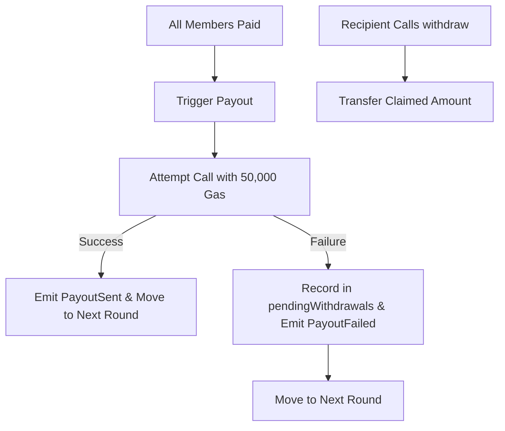

# Secure EVM Payout Fallback & Gas Limits

This document details the architectural design and security mitigation strategy implemented to prevent Denial of Service (DOS) attacks and stuck funds during the Susu circle payout phase.

## Vulnerability Analysis

The initial implementation of `_triggerPayout` forwarded all remaining gas to the recipient address:
```solidity
(bool sent, ) = recipient.call{value: amount}("");
require(sent, "Payout failed");
```

### Risk Vectors

1. **Denial of Service (DOS)**: If a recipient is a contract that reverts on receiving funds or exceeds block gas limits, any contribution completing a round will revert the entire transaction. This blocks the progression of the circle and permanently freezes participant funds.
2. **Reentrancy**: Forwarding all gas to an untrusted contract address allows the recipient to execute arbitrary code (e.g., calling back into the contract) before the current function execution finishes.
3. **Out-of-Gas Reverts**: Smart contract wallets (e.g., Gnosis Safe, multisig wallets, account abstraction wallets) may consume more than the standard 2,300 gas stipend, but can still fail or consume excessive gas, leading to DOS vulnerabilities.

## Architectural Mitigation

To address these vulnerabilities, we implement two primary controls:

1. **Fallback Gas Limit**: Limit the forwarded gas in the recipient call to exactly `50,000` gas. This is sufficient to support smart contract wallets with standard receive/deposit functions while capping the gas overhead and preventing infinite loops or high gas-guzzling exploits.
2. **Pull-Over-Push Withdrawal Pattern**: If the call fails or runs out of gas, we do not revert. Instead, we transition to a pull-based model:
   - The payout amount is credited to a state mapping `pendingWithdrawals[recipient]`.
   - A `PayoutFailed` event is emitted.
   - The circle round progresses normally, allowing subsequent rounds to continue unaffected.
   - The recipient can call a public `withdraw()` function to claim their pending funds at any time.

## Execution Flow


